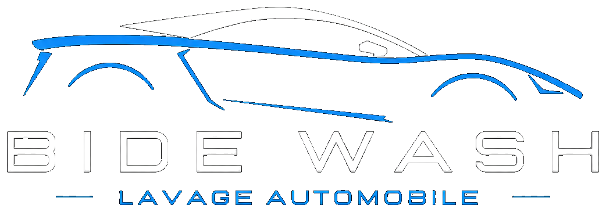

# BIDÈ — Lavage Automobile Professionnel



Site statique de présentation et de gestion locale pour BIDÈ, un service de lavage automobile au Togo. Le projet comprend une page publique, un espace client et un espace d’administration.

> Les données sont stockées dans le navigateur avec `localStorage`. Le projet ne possède pas de backend, de base de données distante, d’authentification serveur ni de paiement réel.

## Sommaire

- [Fonctionnalités disponibles](#fonctionnalités-disponibles)
- [Technologies](#technologies)
- [Installation](#installation)
- [Structure du projet](#structure-du-projet)
- [Fonctionnement](#fonctionnement)
- [Limites actuelles](#limites-actuelles)
- [Roadmap](#roadmap)

## Fonctionnalités disponibles

### Site public

- Page d’accueil avec vidéo hero, lecture/pause et effet parallaxe.
- Présentation des services, tarifs, avantages et informations de contact.
- Galerie filtrable avec lightbox.
- FAQ avec recherche.
- Formulaire de contact avec message de confirmation côté navigateur.
- Carte OpenStreetMap intégrée.
- Navigation fixe, lien actif au défilement, animations d’apparition et compteurs animés.

### Espace client

- Connexion et inscription simulées, enregistrées dans `localStorage`.
- Tableau de bord client, profil, véhicules, factures, avis, notifications, paramètres et déconnexion.
- Gestion locale des véhicules et consultation du suivi des demandes.
- Consultation et règlement simulé des factures (aucune transaction bancaire ou Mobile Money n’est envoyée).
- Gestion locale des avis, préférences et photo de profil.

### Espace administrateur

- Tableau de bord avec indicateurs calculés depuis les données locales.
- Pages de gestion des clients, réservations, véhicules, services, paiements, messages, avis, employés, administrateurs et paramètres.
- Modules JavaScript dédiés pour les clients, réservations, paiements, messages et employés.
- Création, modification, suppression, recherche ou filtrage disponibles selon les pages.

## Technologies

| Domaine | Technologie utilisée |
| --- | --- |
| Structure | HTML5 |
| Styles | CSS3, Bootstrap 5.3 et Bootstrap Icons (CDN) |
| Interactivité | JavaScript vanilla |
| Stockage | `localStorage` du navigateur |
| Médias externes | Cloudinary, Unsplash et OpenStreetMap |
| Déploiement cible | Hébergement statique compatible Vercel |

## Installation

Le projet ne nécessite aucune dépendance à installer. Lancez simplement un serveur HTTP local depuis la racine :

```bash
python -m http.server 3000
```

Puis ouvrez `http://localhost:3000`.

Vous pouvez aussi utiliser :

```bash
npx serve . -l 3000
```

## Structure du projet

```text
bide/
├── index.html                 # Site public
├── css/
│   ├── style.css              # Styles du site public
│   └── connexion.css          # Styles de connexion
├── js/
│   ├── bide.js                # Données métier et synchronisation locale
│   ├── session.js             # Affichage de la session
│   ├── inscrit.js             # Inscription / connexion
│   ├── main.js                # Interactions du site public
│   ├── gallery.js             # Galerie et lightbox
│   └── faq.js                 # Recherche FAQ
├── images/                    # Logos et images locales
├── video/                     # Ressources vidéo locales éventuelles
├── client/                    # Pages de l’espace client
│   ├── css/client-responsive.css
│   └── js/factures.js
├── admin/                     # Pages de l’espace administrateur
│   ├── css/
│   └── js/
└── README.md
```

## Fonctionnement

### Stockage local

Les données sont conservées dans le navigateur. Les clés actuellement utilisées comprennent notamment :

- `bide_session` et `bide_users` : session et comptes locaux ;
- `bide_requests`, `bide_clients` et `bide_vehicles` : demandes, clients et véhicules ;
- `bide_invoices` : factures ;
- `bide_services`, `bide_employees` et `bide_avis` : données de gestion ;
- `bide_settings`, `bide_theme`, `bide_language` et préférences de notification : paramètres locaux.

Le module `js/bide.js` écoute l’évènement `storage` pour répercuter certaines mises à jour entre les onglets du même navigateur.

### Limites actuelles

- Les comptes et sessions ne sont pas sécurisés : ils résident uniquement dans `localStorage`.
- Les paiements, notifications et messages ne sont pas connectés à des services externes.
- Le formulaire de contact n’envoie pas de courriel.
- Les liens sociaux de la page d’accueil sont des liens vides.
- Une connexion internet est nécessaire pour les bibliothèques CDN, les médias distants et la carte.

## Roadmap

- [ ] 🌐 Traduction multilingue (Français / Ewe / English)
- [ ] 💳 Intégration paiement réel (MoovMoney, TMoney)
- [ ] 🔔 Notifications push (Web Push API)
- [ ] 📊 Dashboard admin avec graphiques (Chart.js)
- [ ] 🗄️ Backend réel (Node.js / Express + MongoDB)
- [ ] 🔐 Authentification sécurisée (JWT)
- [ ] 📱 Application mobile (React Native / PWA)
- [ ] 🌙 Mode sombre
- [ ] 📧 Emails transactionnels (Nodemailer / SendGrid)
- [ ] 📍 Géolocalisation temps réel des véhicules

## Licence

Projet propriétaire. Tous droits réservés © 2026 BIDÈ.
